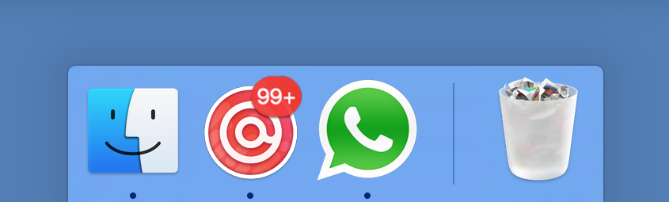

# Redkix Nativefier



This will create a native wrapper for **Redkix** including development environments

## ON OS X
```bash
nativefier$ npm run dev-up
nativefier$ npm link
nativefier$ node buildProduction.js
```

## ON WINDOWS
```bash
nativefier$ npm install
nativefier$ cd app
nativefier$ npm install
nativefier$ cd ..
nativefier$ npm link
nativefier$ node buildProduction.js
```

You're done.

## Introduction

Nativefier is a command line tool that allows you to easily create a desktop application for Redkix. The Redkix apps will be wrapped by [Electron](http://electron.atom.io) in an OS executable (`.app`, `.exe`, etc.) for use on Windows, OSX and Linux.

-------

Read the [API documentation](docs/api.md) for other command line flags and options that can be used to configure the packaged app.

If you would like high resoulution icons to be used, please contribute to the [icon repository](https://github.com/jiahaog/nativefier-icons)!

**For Windows Users:** Take note that the application menu is automatically hidden by default, you can press `alt` on your keyboard to access it.

**For Linux Users:** Do not put spaces if you define the app name yourself with `--name`, as this will cause problems (tested on Ubuntu 14.04) when pinning a packaged app to the launcher.

## Optional Dependencies

### Icons for Windows Apps from non-Windows platforms

You need [Wine](https://www.winehq.org/) installed, make sure that `wine` is in your `$PATH`.

### Icon Conversion for OSX

To support conversion of a `.png` or `.ico` into a `.icns` for a packaged OSX app icon (currently only supported on OSX), you need the following dependencies.

#### [iconutil](https://developer.apple.com/library/mac/documentation/GraphicsAnimation/Conceptual/HighResolutionOSX/Optimizing/Optimizing.html)

You need [XCode](https://developer.apple.com/xcode/) installed.

#### [imagemagick](http://www.imagemagick.org/script/index.php)

Make sure `convert` and `identify` are in your `$PATH`.

### Flash

#### [Google Chrome](https://www.google.com/chrome/)

Google Chrome is required for flash to be supported. Alternatively, you could download the PepperFlash Chrome plugin and specify the path to it directly with the `--flash` flag. See the command line options below for more details.

## How It Works

A template app with the appropriate event listeners and callbacks set up is included in the `./app` folder. When the `nativefier` command is executed, this folder is copied to a temporary directory with the appropriate parameters in a configuration file, and is packaged into an app with [Electron Packager](https://github.com/electron-userland/electron-packager).

In addition, I built [GitCloud](https://github.com/jiahaog/gitcloud) to use GitHub as an icon index, and also the [pageIcon](https://github.com/jiahaog/page-icon) fallback to infer a relevant icon from a url.

## API Documentation

See [API](docs/api.md).

## Changelog

See [Changelog](docs/changelog.md).

## Development

See [Development](docs/development.md).

## License

[MIT](LICENSE.md)
